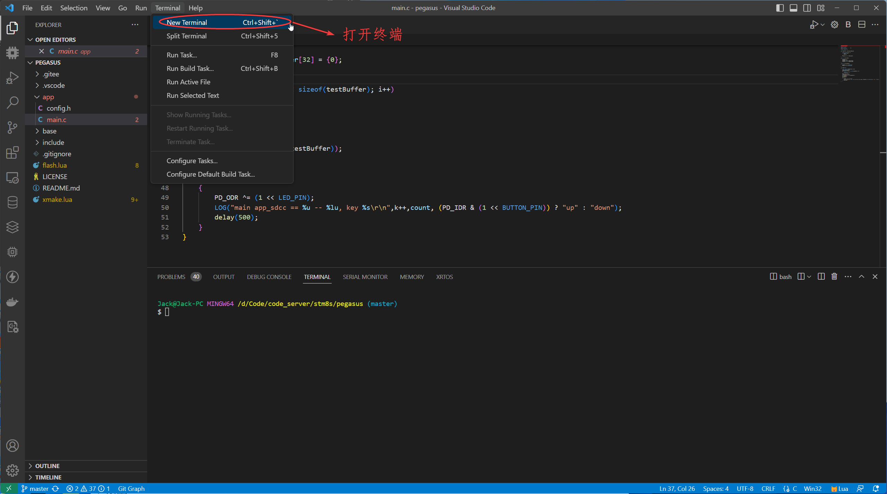
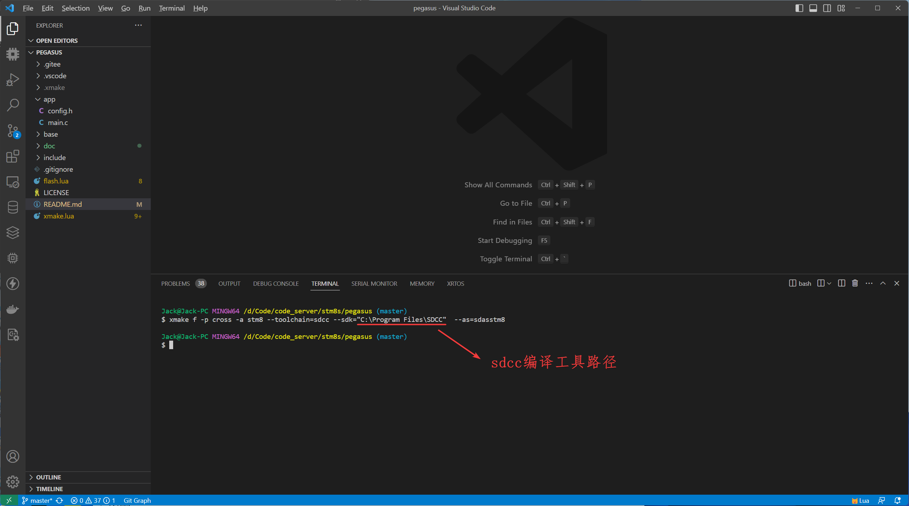
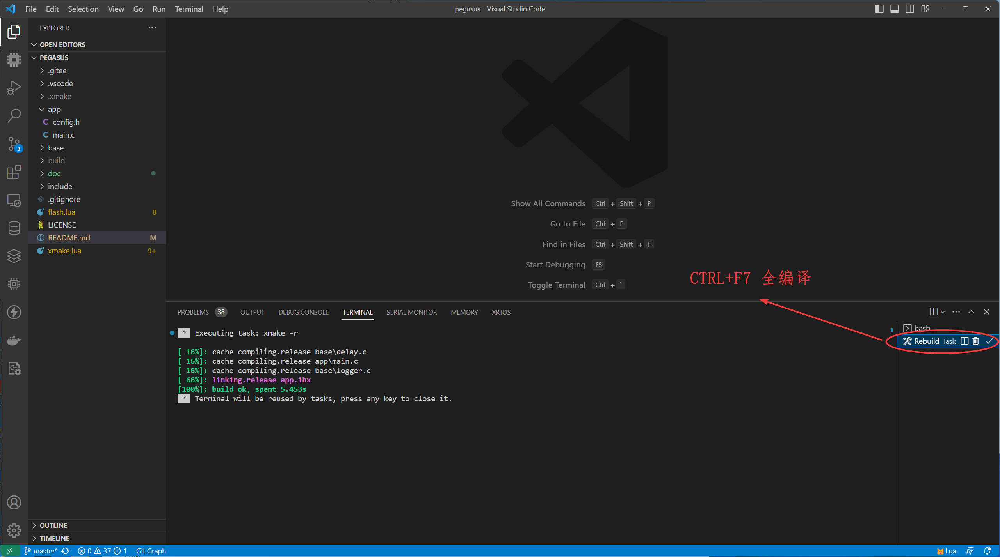
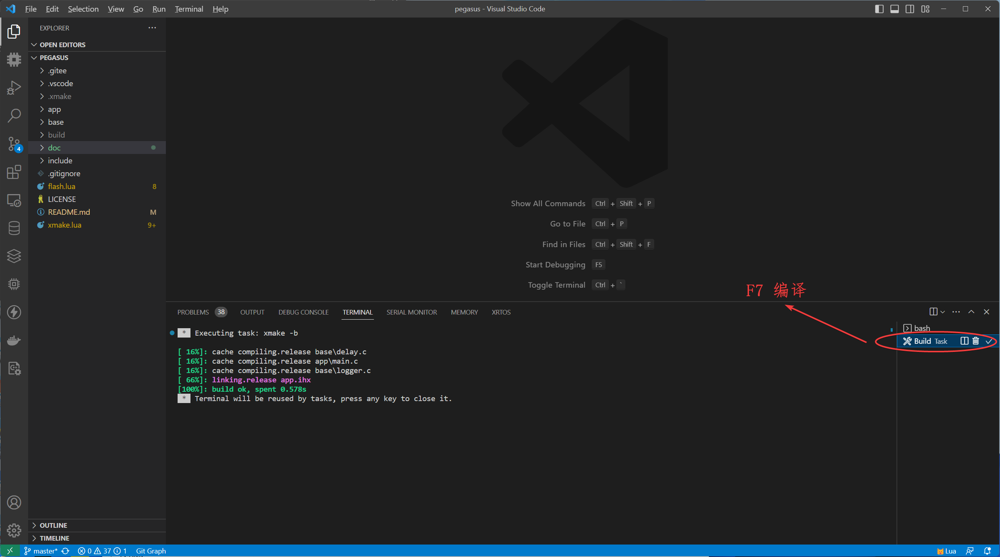
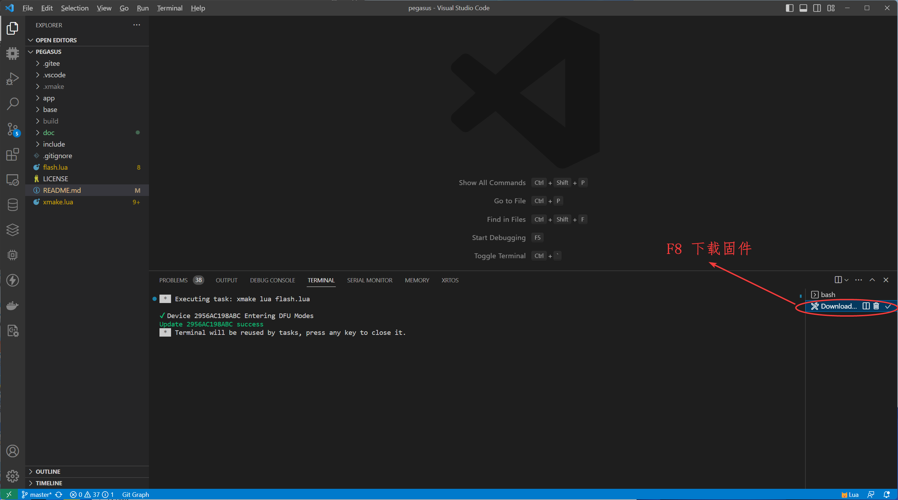

# Pegasus天马座 示例工程

## 首次使用工程配置步骤
参考 [安装教程
](https://wecanstudio.umetav.cn/manual/zh-cn/docs/doc3) ,确保系统中已经安装好了开发环境。
### 第一步 添加工程快捷键
- 参考 [配置VSCode快捷键](https://wecanstudio.umetav.cn/manual/zh-cn/docs/doc3#%E4%BA%8C%E9%85%8D%E7%BD%AEvscode%E5%BF%AB%E6%8D%B7%E9%94%AE) 进行编译及下载快捷键设置。

### 第二步 配置工具链   
在VSCode中打开终端   


配置编译工具链命令:
```shell
xmake f -p cross -a stm8 --toolchain=sdcc --sdk="{路径}"  --as=sdasstm8
```
注:命令中的`{路径}`,为SDCC编译工具的安装路径   


## 编译工程
- 全编译   
  `CTRL + F7`   
  
- 编译  
  `F7`   
  
- 下载  
  `F8`   
  


## 示例工程介绍
- [文档地址](https://wecanstudio.umetav.cn/manual/zh-cn/docs/doc6#pegasus%E5%A4%A9%E9%A9%AC%E5%BA%A7)