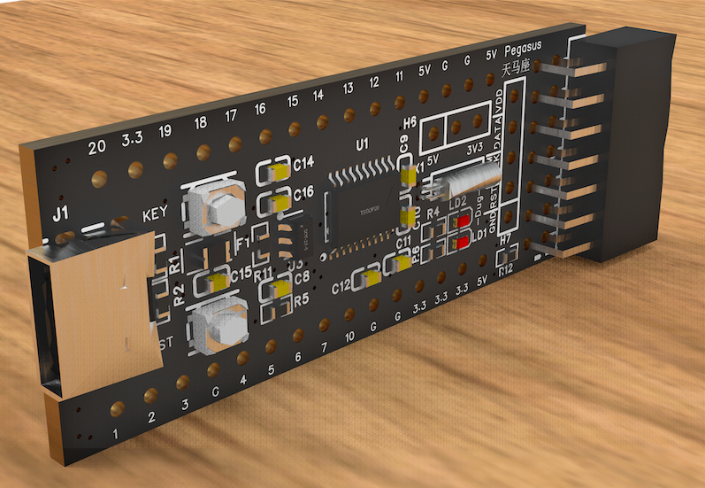
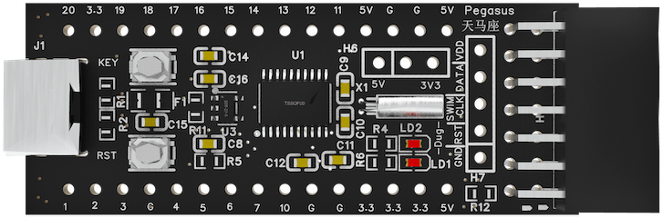
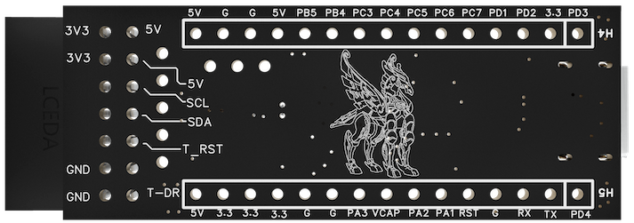

[中文](https://github.com/WeCanSTU/Pegasus/blob/main/README_CN.md) / [English](https://github.com/WeCanSTU/Pegasus/blob/main/README.md)

# Pegasus MCU Core Board

## Product Overview

Pegasus is a high-performance, low-power MCU core board designed based on the [STM8S003F3 microcontroller](https://www.st.com/en/microcontrollers-microprocessors/stm8s003f3.html). This core board is equipped with an 8-bit STM8 core running at a frequency of up to 16MHz, 8KB of Flash memory, 1KB of RAM, and 128 bytes of EEPROM. It is particularly suited for industrial control, portable devices, and embedded development applications. With its compact hardware design and flexible interface resources, it provides developers with a highly efficient, all-in-one solution.

## Key Features
Below is the schematic diagram showcasing the functionality of the core board, providing a detailed view of the circuit design:

- **Processor**: 8-bit STM8 core with a 16MHz clock frequency, supporting Harvard architecture and a three-stage pipeline.
- **Memory Resources**: 8KB Flash, 1KB RAM, and 128 bytes of EEPROM, supporting up to 100,000 write cycles.
- **Low-Power Design**: Supports multiple low-power modes, including Wait, Active Halt, and Halt modes, ideal for battery-powered applications.
- **Rich Peripherals**:
  - 10-bit ADC: Supports 5-channel analog input with scan mode and analog watchdog functionality.
  - Timers: Includes one advanced 16-bit timer, one 16-bit general-purpose timer, and one 8-bit basic timer, supporting PWM output.
  - Communication Interfaces: Supports UART, SPI, and I2C communication protocols.

## Hardware Design Highlights

- **Power and Indicator LEDs**:
  - **Status Indicator (LD1)**: Controlled by the PD4 pin of the chip, it indicates operational status or can be customized for user-defined functions.
  - **Power Indicator (LD2)**: Displays the power status of the core board in real-time.
- **Button Functionality**:
  - **User Button (KEY)**: Connected to the PD3 pin, providing flexible user interaction capabilities.
  - **Reset Button (RST)**: Allows manual reset, facilitating debugging and development.
- **Expansion Interfaces**:
  - **Type-C Interface**: Provides 5V independent power supply, compliant with Type-C power standards, suitable for portable devices.
  - **20-Pin Header**: Offers abundant GPIO, power, and communication pins, supporting a variety of peripheral expansions.
  - **I2C Interface**: Designed for interfacing with other boards, enabling quick communication and feature expansion.
  - **SWIM Debugging Interface**: Supports single-wire debugging and fast firmware downloading.

## Front and Back Design Analysis

### Front Design

- Integrates the STM8S003F3 chip and its peripheral circuits.
- Provides a standard pin header interface with comprehensive GPIO and communication resources.
- LD1 and LD2 LEDs offer intuitive feedback on operational and power status.

### Back Design

- Features an elegant Pegasus pattern symbolizing speed and inspiration.
- Clearly labeled pins covering power, GPIO, and reset functionality.

## Application Scenarios

- **Embedded Learning and Prototyping**: The simple and user-friendly design helps developers quickly get started.
- **Industrial Control**: Offers high reliability and flexible expansion capabilities.
- **Portable Devices**: Independent Type-C power supply and low-power design make it ideal for portable applications.
- **Product Development and Validation**: Enables rapid functional verification and solution optimization for embedded systems.

## Conclusion

The Pegasus MCU core board offers high performance, low power consumption, and rich interface design, providing embedded developers with a powerful development platform. Whether for learning, prototyping, or commercial applications, Pegasus can help you achieve innovation quickly.

## Resources and Support
- **Forum**: [Pegasus Discussion Forum](https://forum.umetav.cn/t/pegasus)  
  - **Operating Hours**: Daily from 8:00 AM to 1:00 AM Beijing Time.
- **QQ Group**: 786239575
- **Technical Support Email**: [tech@umetav.cn](mailto:tech@umetav.cn)

Feel free to contact us through these channels for more information or technical support regarding Phoenix Core Board.