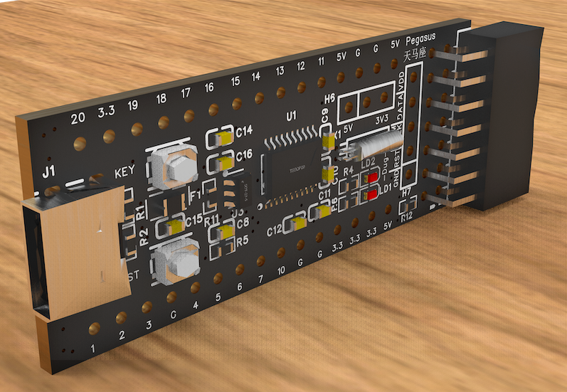
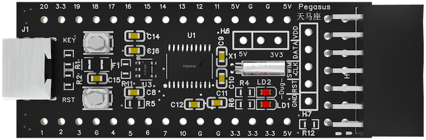
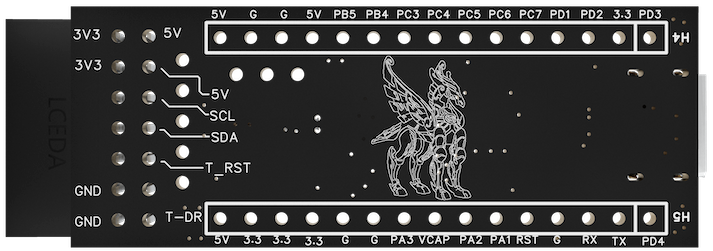

[中文](https://github.com/WeCanSTU/Pegasus/blob/main/README_CN.md) / [English](https://github.com/WeCanSTU/Pegasus/blob/main/README.md)

# Pegasus 天马座 MCU核心板

## 产品简介

Pegasus 天马座是一款基于[STM8S003F3微控制器](https://www.st.com/en/microcontrollers-microprocessors/stm8s003f3.html)设计的高性能、低功耗MCU核心板。该核心板采用8位STM8内核，主频高达16MHz，提供8KB Flash存储和1KB RAM，以及128字节EEPROM，非常适合用于工业控制、便携设备和嵌入式开发应用。其紧凑的硬件设计和灵活的接口资源，为开发者提供高效的一站式解决方案。

## 核心特性
以下是展示核心板功能的电路设计图，提供电路设计的详细视图：

- **处理器**: 8位STM8核心，主频16MHz，支持Harvard架构和三阶段流水线。
- **存储资源**: 8KB Flash、1KB RAM和128字节EEPROM，支持高达10万次写入周期。
- **低功耗设计**: 支持多种低功耗模式，包括Wait、Active Halt和Halt模式，适合电池供电场景。
- **丰富外设**:
  - 10位ADC：支持5通道模拟输入，具有扫描模式和模拟看门狗功能。
  - 定时器：包含1个高级16位定时器、1个16位通用定时器和1个8位基本定时器，支持PWM输出。
  - 通信接口：支持UART、SPI和I2C等通信协议。

## 硬件板设计亮点

- **电源与指示灯**:
  - **状态指示灯（LD1）**: 由芯片PD4控制，用于指示运行状态或用户自定义功能。
  - **电源指示灯（LD2）**: 实时显示核心板供电状态。
- **按键功能**:
  - **自定义按键（KEY）**: 连接至PD3引脚，提供灵活的用户交互能力。
  - **复位按键（RST）**: 支持手动复位功能，便于调试和开发。
- **扩展接口**:
  - **Type-C接口**: 提供5V独立供电，符合Type-C供电标准，便于便携设备使用。
  - **20针排针接口**: 提供丰富的GPIO、电源和通信引脚，支持多种外设扩展。
  - **I2C接口**: 专为与其他板卡对接设计，支持快速实现通信和功能扩展。
  - **SWIM调试接口**: 支持单线调试和快速固件烧录。

## 正反面功能解析

### 正面设计

- 集成STM8S003F3芯片及其外围电路。
- 标准排针接口，提供全面的GPIO和通信资源。
- LD1和LD2指示灯直观反馈运行和供电状态。

### 背面设计

- 精美的天马图案象征速度与灵感。
- 引脚标注清晰，涵盖电源、GPIO和复位引脚。

## 应用场景

- **嵌入式学习与原型开发**: 简单易用的设计，帮助开发者快速上手。
- **工业控制**: 提供高可靠性和灵活扩展能力。
- **便携设备**: Type-C独立供电和低功耗设计非常适合便携设备使用。
- **产品开发与验证**: 快速实现嵌入式功能验证和方案优化。

## 总结

Pegasus 天马座核心板以其高性能、低功耗和丰富的接口设计，为嵌入式开发者提供强大的开发平台。无论是学习、开发还是商业应用，它都能助您快速实现创新。

## 资源与支持

- **论坛**: [Pegasus天马座](https://forum.umetav.cn/t/pegasus)  
  - **开放时间**: 北京时间每日早上8点到凌晨1点。
- **QQ群**: 123456789
- **技术支持邮箱**: [tech@umetav.cn](mailto:tech@umetav.cn)